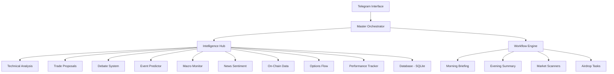

# 🦅 ShufaClaw Master Handbook: The Complete Guide

Welcome to the **ShufaClaw Master Handbook**. This document serves as a comprehensive, human-readable, and AI-optimized guide to the ShufaClaw Personal Cryptocurrency Intelligence Agent. Whether you are a human trader or an AI assistant interacting with this code, this guide explains everything from the core philosophy to the most advanced features.

---

## 🎯 1. What is ShufaClaw?

ShufaClaw is a **Personal Cryptocurrency Intelligence Agent**. It is built to act as a "Second Brain" for crypto traders, moving beyond simple price alerts to provide deep, actionable insights using 9 distinct intelligence sources.

### Core Philosophy
- **Data-Driven Decisions**: Every piece of advice is backed by technical, fundamental, on-chain, or sentiment data.
- **Risk-First Approach**: The bot prioritizes capital preservation through automated risk analysis and position sizing.
- **Continuous Learning**: The system tracks its own accuracy and learns from its mistakes over time.
- **Simple Interaction**: Complex analysis is delivered in "Plain English" via a Telegram interface.

---

## 🏗️ 2. System Architecture

ShufaClaw is organized into a modular structure, making it highly reliable and easy to expand.

- **`crypto_agent/core`**: The "Central Nervous System" (Orchestrator, Workflows, Task Queue).
- **`crypto_agent/intelligence`**: The "Brains" (Hub, ML Signals, Backtesting, Debate System).
- **`crypto_agent/data`**: The "Senses" (Prices, News, Social, Institutional Flows).
- **`crypto_agent/bot`**: The "Voice" (Telegram handlers and interactive UI).
- **`crypto_agent/storage`**: The "Memory" (Database logic for trades, alerts, and settings).

---

## 🧠 3. The Master Brain: Intelligence Hub

The **Intelligence Hub** is the flagship feature. Instead of giving you a single indicator, it aggregates 9 sources into a **Unified Signal**.

### How it Weights Data:
1.  **Technical Analysis (20%)**: RSI, MACD, Patterns, Trends.
2.  **Trade Proposals (15%)**: Risk-to-Reward (R:R) setups and Expected Value.
3.  **Debate System (15%)**: A 3-analyst debate (Bull vs. Bear vs. Quant).
4.  **Event Predictor (10%)**: Token unlocks, news catalysts, and macro events.
5.  **Macro Monitor (10%)**: DXY (US Dollar), SPX (S&P 500) correlation, and regime detection.
6.  **News Sentiment (10%)**: Real-time mood analysis from thousands of articles.
7.  **On-Chain Data (8%)**: Whale movements, exchange flows, and network health.
8.  **Options Flow (7%)**: Put/Call ratios, Max Pain levels, and Implied Volatility (IV).
9.  **Performance Tracking (5%)**: How well the bot has predicted this specific coin in the past.

---

## 📅 4. Automation & Workflows

ShufaClaw works even when you aren't looking at your phone.

- **Morning Briefing (8:00 AM)**: A 3-minute summary of the overnight action, current portfolio status, and the day's top focus.
- **Evening Summary (9:00 PM)**: Review of the day's P&L, performance of holdings, and a "Plan for Tomorrow."
- **Opportunity Scanner**: Runs 4 types of scans (Oversold, Funding Extremes, 90-Day Highs, Sector Rotation) to find hidden gems.
- **Airdrop Task Engine**: Automatically tracks upcoming airdrop snapshops and provides a daily checklist of tasks to maximize your rewards.

---

## 📟 5. Command Reference

### 📊 Portfolio & Risk
- `/portfolio`: Complete view of holdings with real-time P&L.
- `/optimize`: AI-driven analysis of your portfolio health and concentration risk.
- `/risk`: Dashboard showing current portfolio "heat" and drawdown risk.
- `/rebalance`: Calculates the exact steps to reach your target allocation.
- `/kelly`: Uses the Kelly Criterion to suggest the perfect bet size.

### 🔍 Intelligence & Analysis
- `/signal <symbol>`: Get the **Unified Recommendation** (BUY/SELL/HOLD) with confidence levels.
- `/debate <symbol>`: Triggers a deep AI debate between Bullish and Bearish personas.
- `/ta <symbol>`: Detailed technical breakdown with 9 indicators.
- `/research <symbol>`: 6-section deep-dive report on any coin.
- `/ml <symbol>`: Machine learning price targets and anomaly detection.

### 🌍 Market & On-Chain
- `/market`: Global market overview (Fear & Greed, Market Cap, Dominance).
- `/onchain`: Check whale flows and gas prices.
- `/institutional`: See what "Smart Money" (companies like Tesla/MicroStrategy) are doing.
- `/yields`: Find the highest-paying DeFi opportunities.

### 📝 Journaling & Evolution
- `/log`: Add a quick entry to your trading journal.
- `/note`: Store a permanent rules or strategy reminder.
- `/accuracy`: See the bot's track record for predictions.
- `/weeklyreview`: Sunday analysis of your week's trading habits.

---

## 🪂 6. Airdrop Intelligence (Special Module)
ShufaClaw includes a dedicated airdrop system:
- **/airdrop**: Overview of tracked protocols and criteria status.
- **/airdroptasks**: Your daily checklist for maximizing reputation.
- **/linkwallet**: Connects your public address to track your "AirDrop Reputation" (0-100).
- **/mywallet**: Detailed breakdown of your on-chain activity and "Sybil Flags."

---

## ⚡ 7. Under the Hood (For Techies & AIs)
- **Tech Stack**: Python 3.9+, Asyncio, SQLite, Telegram-bot-api.
- **APIs**: Binance, CoinGecko, DeFiLlama, Etherscan, Deribit, CryptoPanic.
- **Data Models**: Uses standard `dataclasses` for all signals to ensure consistency.
- **Performance**: Automated Task Queue allows for parallel fetching of 10+ data points in <3 seconds.

---

## 🛡️ 8. Security & Operating Modes
ShufaClaw adapts to the market surroundings via the **Master Orchestrator**:
- **BULL REGIME**: Optimistic tone, relaxed alerts, focus on momentum.
- **BEAR REGIME**: Cautious tone, heightened alerts, focus on capital preservation.
- **QUIET MODE**: Bot remains silent except for critical portfolio alerts.
- **NIGHT MODE**: Automatic suppression of non-essential messages during sleep hours.

---

## 🛠️ 9. Troubleshooting & Safety (Rule #3)

As a non-coder, if something breaks, it usually looks like the bot "stopped replying" or "is throwing weird red text in the terminal."

### Common Errors & Fixes:
1. **Error: `ModuleNotFoundError` (Missing Library)**
   - **What it looks like**: Terminal says `ModuleNotFoundError: No module named '...'`
   - **How to fix**: Run `pip install -r requirements.txt` in your terminal.

2. **Error: `Invalid API Key`**
   - **What it looks like**: Bot says "Error: Access Denied" or "401 Unauthorized" when you ask for a price or research.
   - **How to fix**: Open your `.env` file and make sure your keys (OpenRouter, Binance, etc.) are correct and have no extra spaces.

3. **Error: Bot is "Offline" or not responding**
   - **What it looks like**: You type a command and nothing happens.
   - **How to fix**: Check your internet. If that's fine, close the terminal window where `main.py` is running and start it again by typing `py main.py`.

4. **Error: `Database Is Locked`**
   - **What it looks like**: Terminal shows a long error ending in `sqlite3.OperationalError: database is locked`.
   - **How to fix**: This happens if you have two versions of the bot running or a database viewer open. Close all bot windows and restart just one.

---

## 📁 10. Clean File Structure (Rule #7)

To keep your project professional, we organize files as follows:
- **`/crypto_agent`**: All the "brains" and logic.
- **`/old`**: Where we move finished prompts and old scripts.
- **`main.py`**: The only file you ever need to "Run."
- **`.env`**: Your secret vault (Never share this!).

---

**ShufaClaw** is more than a bot; it's a complete ecosystem designed to turn data into profit and mistakes into lessons. 🦅
